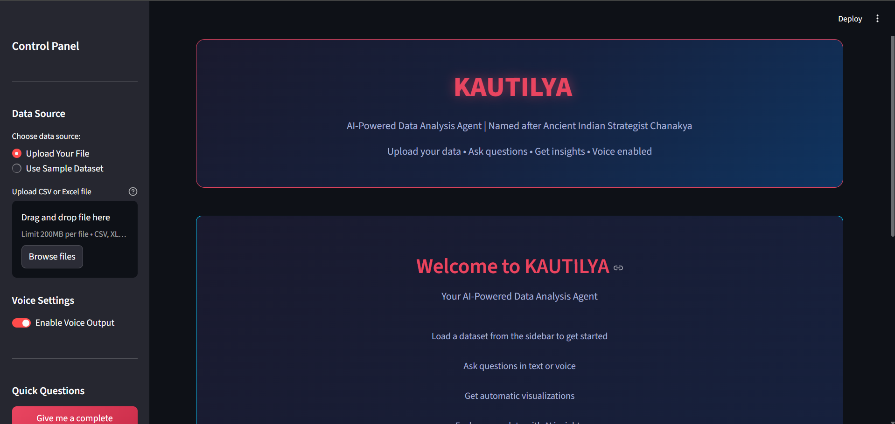

<div align="center">

# 🤖 KAUTILYA
## AI-Powered Data Analysis Agent

*Named after Chanakya — Ancient Indian Strategist & Mastermind*

<br>

[](https://kautilya-ai-data-analysis-agent-9ykvqyhu94wxhff5eshcck.streamlit.app/)
[](https://python.org)
[](https://groq.com)
[](https://streamlit.io)
[](https://kautilya-ai-data-analysis-agent-9ykvqyhu94wxhff5eshcck.streamlit.app/)

<br>

**Drop any dataset. Ask anything. Get instant AI-powered insights.**
*The world's fastest LLM meets your data — in seconds.*

</div>

---

## 🌐 Try It Live — No Installation Needed!

<div align="center">

### 👇 Click below to open the live app instantly

[](https://kautilya-ai-data-analysis-agent-9ykvqyhu94wxhff5eshcck.streamlit.app/)

> ⚠️ **Note:** Voice features require a local setup (microphone hardware).
> AI Chat, Visualizations & Data Upload work fully on the live demo.

</div>

---

## 📸 Screenshots

<div align="center">

### 🏠 Main Interface


</div>

<br>

| 📂 Dataset Loaded | 🤖 AI Answering Questions |
|:---:|:---:|
|  |  |

<br>

<div align="center">

### 📊 Auto Visualizations


</div>

<br>

<div align="center">

### 🎤 Voice & Controls


</div>

---

## 🧠 What is KAUTILYA?

KAUTILYA is a **Generative AI + Agentic AI** application built for data analysis.
Unlike a regular chatbot, KAUTILYA thinks and acts like a real data scientist:

| Regular Chatbot | 🤖 KAUTILYA |
|---|---|
| Answers fixed questions | Understands **any** dataset |
| No memory | Maintains **full conversation** context |
| Text only | Generates **auto visualizations** |
| Reactive | **Proactively** recommends next steps |
| One-time answers | Finds **anomalies & hidden trends** |

---

## ✨ Key Features

| Feature | Details |
|---|---|
| 🧠 **Groq LLaMA3 70B** | World's fastest AI inference — answers in milliseconds |
| 📁 **Any Dataset** | Upload CSV or Excel — auto encoding detection included |
| 🎤 **Voice Input** | Speak in Hindi or English (local setup) |
| 🔊 **Voice Output** | Responses read aloud via Google Text-to-Speech (local) |
| 📊 **Auto Visualizations** | Distribution, Correlation Heatmap, Categories, Missing Values |
| 🔍 **Auto Analysis** | One click → complete dataset intelligence report |
| 💬 **Conversation Memory** | Maintains full chat context across multiple questions |
| 🔐 **Secure API** | Key stored in `.env` — never exposed, never pushed to GitHub |

---

## 🛠️ Tech Stack

| Layer | Technology |
|---|---|
| 🧠 AI Brain | Groq API + LLaMA3 70B |
| 🖥️ Frontend | Streamlit |
| 📊 Data | Pandas + OpenPyXL |
| 📈 Charts | Matplotlib + Seaborn + Plotly |
| 🎤 Voice Input | SpeechRecognition + Google Speech API |
| 🔊 Voice Output | gTTS + pygame |
| 🔐 Security | python-dotenv |
| ☁️ Deployment | Streamlit Community Cloud |

---

## 🚀 Run Locally (Full Voice Support!)
```bash
# Step 1 — Clone the repo
git clone https://github.com/DeveshShukla23/KAUTILYA-AI-Data-Analysis-Agent.git
cd KAUTILYA-AI-Data-Analysis-Agent

# Step 2 — Install dependencies
pip install -r requirements.txt

# Step 3 — Add your Groq API key
echo "GROQ_API_KEY=your_key_here" > .env

# Step 4 — Launch!
streamlit run agent.py
```

> 🔑 Get your free Groq API key at: [console.groq.com](https://console.groq.com)
> 🎤 Local setup gives you **full voice support** in Hindi & English!

---

## 📂 Project Structure
```
KAUTILYA-AI-Data-Analysis-Agent/
│
├── agent.py                  ← Main application
├── requirements.txt          ← Python dependencies
├── .gitignore                ← Keeps API key safe
│
├── Order Details.csv         ← E-Commerce sample (500 rows)
├── Sample - Superstore.csv   ← Retail sample (9,994 rows)
│
└── screenshots/
    ├── Kautilya_UI2.png
    ├── Kautilya Load Dataset.png
    ├── kautilya Question asked.png
    ├── kautilya speak button.png
    └── Kautilya visualization.png
```

> ⚠️ NIFTY50 dataset not included — exceeds GitHub 25MB limit.
> Download from [Kaggle](https://www.kaggle.com/datasets/rohanrao/nifty50-stock-market-data) and place in the project folder.

---

## 📊 Sample Datasets

| Dataset | Rows | Domain | Included |
|---|---|---|---|
| Order Details | 500 | 🛒 E-Commerce | ✅ Yes |
| Sample Superstore | 9,994 | 🏪 Retail Sales | ✅ Yes |
| NIFTY50 Stock Data | 235,192 | 📈 Stock Market | ⬇️ Download separately |

---

## 🔐 Security

| What | How |
|---|---|
| API Key storage | Stored in `.env` file locally |
| Git protection | `.env` listed in `.gitignore` |
| Cloud security | Key stored in Streamlit Secrets |
| Result | Key is **NEVER** pushed to GitHub |

---

## 🔮 Future Improvements

- [ ] 📡 Real-time database connectivity
- [ ] 🤖 Automated ML model training on uploaded data
- [ ] 📄 PDF report generation
- [ ] 🔗 Multi-step agent planning with LangChain
- [ ] 🗣️ Full Hindi/Hinglish language support
- [ ] 🎤 Cloud voice support workaround

---

## 👨‍💻 About the Author

<div align="center">

### Devesh Shukla

*AI & Data Science Enthusiast | Builder of Intelligent Systems*

I am a passionate developer focused on building real-world AI applications
that solve meaningful problems. KAUTILYA is one such project — combining
**Agentic AI**, **voice technology**, and **data analytics** into a single
powerful tool inspired by ancient Indian wisdom.

<br>

[](https://www.linkedin.com/in/devesh-shukla23)
[](https://github.com/DeveshShukla23)
[](mailto:shukladevesh40@gmail.com)

<br>

---

*⭐ If KAUTILYA helped or impressed you, give it a star — it means a lot!*

*🔁 Feel free to fork, improve, and build on top of this project.*

</div>
