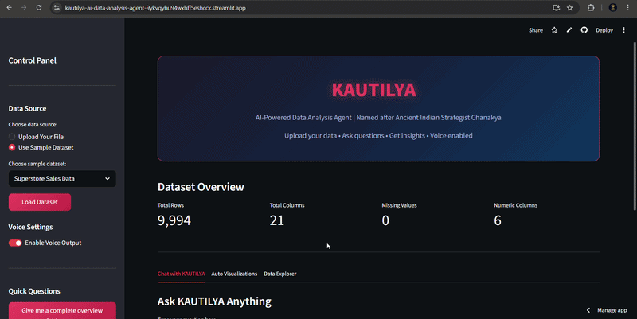
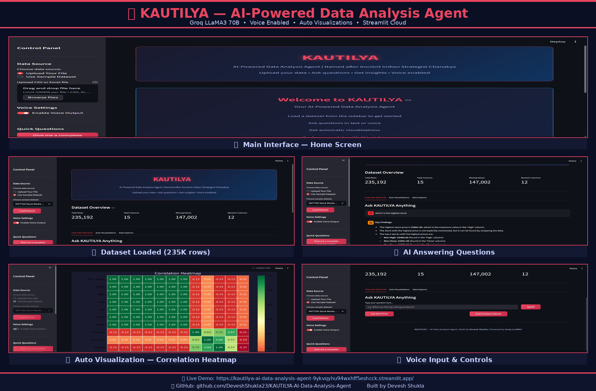

<div align="center">


[](https://git.io/typing-svg)

<br>


<br>

[](https://kautilya-ai-data-analysis-agent-9ykvqyhu94wxhff5eshcck.streamlit.app/)
[](https://www.linkedin.com/in/devesh-shukla23)
[](https://github.com/DeveshShukla23)

</div>

---

## 🤖 About KAUTILYA
```python
kautilya = {
    "name"       : "KAUTILYA — AI-Powered Data Analysis Agent",
    "named_after": "Chanakya (Kautilya) — Ancient Indian Strategist & Master of Intelligence",
    "ai_model"   : "Groq LLaMA3 70B — Fastest AI Inference Available",
    "voice"      : ["Hindi", "English"],
    "input"      : ["CSV", "Excel", "Text Questions", "Voice Questions"],
    "output"     : ["AI Insights", "Auto Visualizations", "Voice Responses"],
    "deployment" : "Live Streamlit App",
    "unique"     : "Agentic AI — thinks, analyzes & recommends autonomously"
}
```

> 🧠 *"Named after the ancient Indian strategist Chanakya — KAUTILYA doesn't just answer questions. It thinks, analyzes, and delivers intelligence."*

---

## 🎬 Live Demo



---

## 🖥️ App Screenshots

### Complete Interface Overview


### Main Interface — Home Screen


### Dataset Loaded — 9,994 Rows


### AI Answering Questions


### Auto Visualization — Correlation Heatmap


### Voice Input & Speak Button


---

## ✨ Key Features

<div align="center">

| Feature | Details |
|:---:|:---|
| 🧠 **AI Brain** | Groq LLaMA3 70B — transformer-based LLM |
| 🎤 **Voice Input** | Hindi & English via Google Speech API |
| 🔊 **Voice Output** | Google Text-to-Speech (gTTS) |
| 📊 **Auto Analysis** | Complete dataset analysis in one click |
| 📈 **Visualizations** | Distribution, Correlation, Categories, Missing Values |
| 🔍 **Data Explorer** | Preview, Statistics, Column Info |
| 🔐 **Security** | API key stored in .env — never exposed |
| 📁 **Sample Datasets** | E-Commerce Orders, Superstore Sales |

</div>

---

## 🤖 What Makes This Agentic AI?
```
Traditional Chatbot    = Answers predefined questions
KAUTILYA (Agentic AI)  = Autonomously:
                         → Loads and understands any dataset
                         → Maintains conversation memory
                         → Generates insights without instructions
                         → Recommends next steps proactively
                         → Responds in voice — Hindi & English
```

---

## 📊 Sample Datasets Included

<div align="center">

| Dataset | Rows | Domain |
|:---:|:---:|:---:|
| Order Details | 500 | E-Commerce |
| Sample Superstore | 9,994 | Retail Sales |
| NIFTY50 *(Download separately)* | 2,35,192 | Stock Market |

</div>

> ⚠️ NIFTY50 dataset not included due to GitHub 25MB limit. Download from [Kaggle](https://www.kaggle.com/datasets/rohanrao/nifty50-stock-market-data) and place in root folder.

---

## 🚀 Run Locally
```bash
git clone https://github.com/DeveshShukla23/KAUTILYA-AI-Data-Analysis-Agent.git
cd KAUTILYA-AI-Data-Analysis-Agent
pip install -r requirements.txt
echo "GROQ_API_KEY=your_groq_api_key_here" > .env
streamlit run agent.py
```

> Get your free API key at: [console.groq.com](https://console.groq.com)

---

## 💡 How to Use
```
1. Run the app locally or open Live App
2. Select data source from sidebar:
   → Upload your own CSV/Excel file
   → Or use provided sample datasets
3. Ask questions in text or voice
4. Click "Auto Analyze Dataset"
   for complete instant analysis
5. Explore visualizations in
   "Auto Visualizations" tab
```

---

## 🔐 Security
```
API Key stored in .env file
.env listed in .gitignore
= API key NEVER pushed to GitHub
= Safe for public repositories
```

---

## 📂 Project Structure
```
KAUTILYA-AI-Data-Analysis-Agent/
│
├── agent.py                          → Main Streamlit application
├── requirements.txt                  → Python dependencies
├── .gitignore                        → Excludes .env file
├── kautilya_demo.gif                 → Live demo animation
├── KAUTILYA_LinkedIn_Collage.png     → App overview collage
├── Kautilya_UI2.png                  → Main interface screenshot
├── Kautilya Load Dataset.png         → Dataset loaded screenshot
├── kautilya Question asked.png       → AI answering screenshot
├── Kautilya visualization.png        → Auto visualization screenshot
├── kautilya speak button.png         → Voice controls screenshot
│
└── Sample Data/
    ├── Order Details.csv             → E-Commerce dataset
    └── Sample - Superstore.csv       → Retail sales dataset
```

---

## 🛠️ Tech Stack

<div align="center">


</div>

---

## 🔮 Future Improvements
```
🔄  Real-time database connectivity
🤖  Automated ML model training on uploaded data
📄  PDF report generation
🧠  Multi-step agent planning using LangChain
🌐  Full Hindi/Hinglish language support
📊  Dashboard mode for business reporting
```

---

## 💡 Skills Demonstrated

<div align="center">

| Agentic AI | Voice Tech | Data Analysis |
|:---:|:---:|:---:|
| ✅ LLM Integration | ✅ Speech Recognition | ✅ Auto EDA |
| ✅ Groq API | ✅ Text-to-Speech | ✅ Auto Visualizations |
| ✅ Conversation Memory | ✅ Hindi & English | ✅ Dataset Intelligence |
| ✅ Autonomous Insights | ✅ Voice Controls | ✅ Business Recommendations |

</div>

---

## 👨‍💻 Author

<div align="center">

**Devesh Shukla**
*Data Analyst | Data Scientist | Agentic AI Builder*

[](https://www.linkedin.com/in/devesh-shukla23)
[](https://github.com/DeveshShukla23)
[](https://kautilya-ai-data-analysis-agent-9ykvqyhu94wxhff5eshcck.streamlit.app/)
[](https://github.com/DeveshShukla23/CHANAKYA)

<br>

⭐ **If you find this useful, please give it a star!** ⭐


</div>
